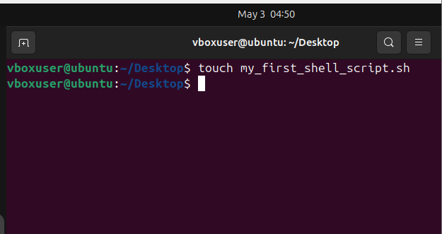
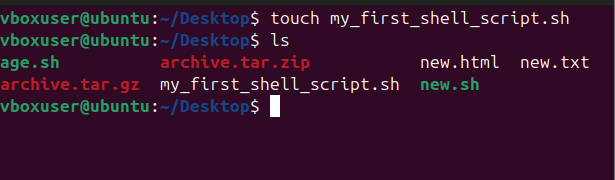
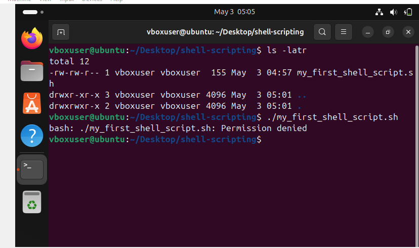
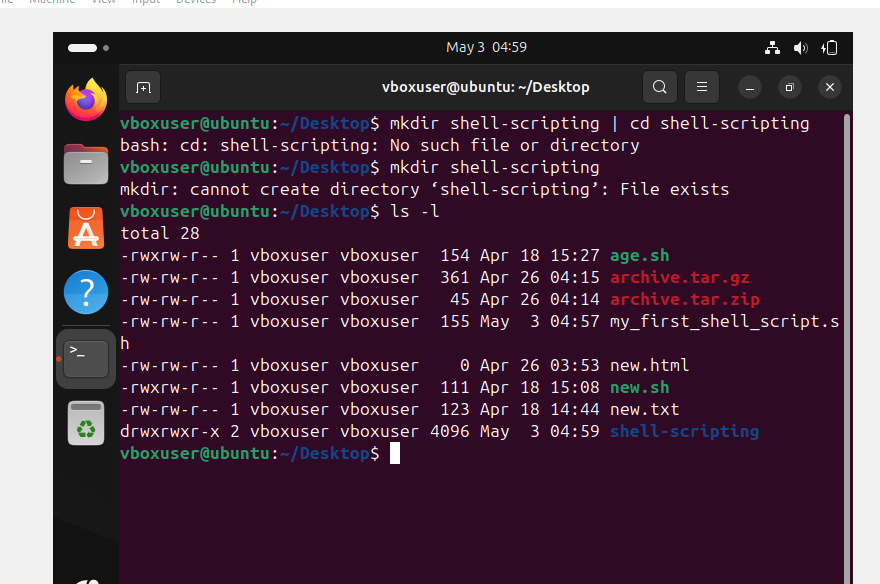
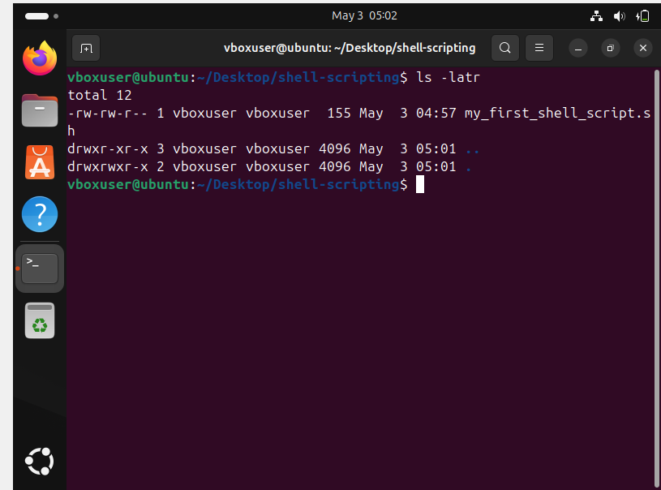
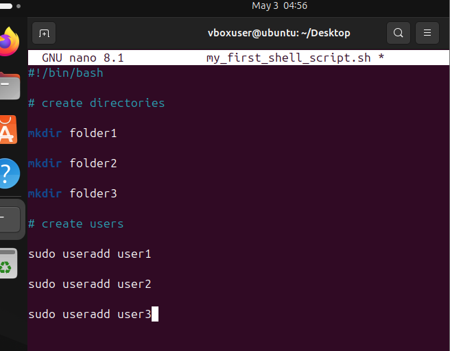
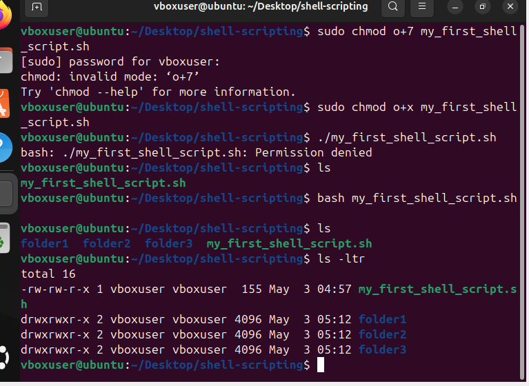
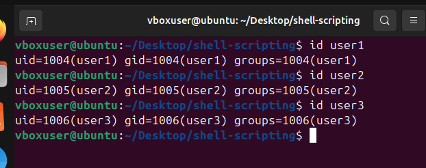
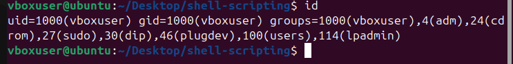
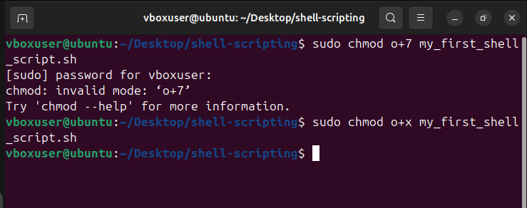

# Creation of the shell script
-- using the touch command to create the shSell

## Error Message

* After completing the shell created trying to run the script brougt out an error message

# Creating the shell

## Entering the shell folder

